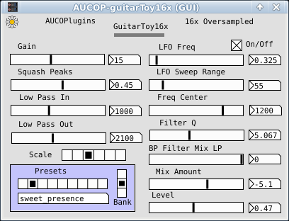

## AUCOP-guitarToy16x

AUCOP-guitarToy16x is a 16x-oversampled guitar audio processor. It includes a custom distortion module, an unusual filter module and a set of presets.

See the AUCOP parent README for installation instructions.

## Plugin use (copy of Info.txt)
---
AUCOP-guitarToy16x is a guitar-oriented effect plugin, with 16x oversampled distortion and simple but powerful pre-filter.

### USE:
--Click on the Preset buttons to reset the parameters. These are loaded from a text file at start-up.

#### Parameters:

- Gain: Distortion gain.
- Squash Peaks: Asymmetrically down-scale the peaks after the first level of distortion is appled. This does lower amplitude, so compensate with Level.
- Low Pass In: Low-pass filter applied after up-sampling.
- Low Pass Out: Low-pass filter applied before down-sampling.
- Scale: Perform a destructive Pre and Post scaling of the signal, before the distortion and after.

#### Preset section
- Preset: Click for preset in current Bank.
- Bank: Click to select Bank.

#### Filter section
- LFO Freq: The filter has an optional LFO to alter the center frequency. On/Off enables/disables the LFO.
- LFO Sweep Range: The center frequency is shifted by this amount by the LFO.
- Freq Center: Filter center frequency.
- Filter Q: The Q value of the filter.
- Filter Mix: Alter the filter mix between Band-Pass and Low-Pass.
- Mix Amount: Mix the filtered signal with the incoming signal.
- Level: Overall volume output level.

#### Notes:
A post-distortion filter is appled before the signal is upsampled. It's currently set to a low frequency, to suppress higher harmonic alias issues.

This corresponds (very) loosely to the frequency response of guitar speakers.

#### AUCOP: An Unfortunate Collection Of Plugins

Plugin build from a PureData vanilla patch, with Camomile.

---

### Thoughts About AUCOP-guitarToy16x

GuitarToy was conceived as a low-impact guitar "enhancer," a plugin that would offer a good basic guitar sound but not be overloaded with features. I always follow it with a reverb or delay effect. There are so many good and optimized reverbs, better to use an existing one.

It's evolved into something not-quite-so-low-impact, but that's due to moving from 8x to 16x oversampling. IMO the 16x version sounded so much better, the extra processing overhead is worth the cost.

A simple, custom distortion function uses the expr~ object, but mostly as a conditional statement and not for number crunching.

The filtering is done before upsampling to conserve cpu cycles. It's also an unusual filter setup; it's somewhat counter-intuitive, but sounds pretty nice. It also includes an LFO sweep function. I included this to add some subtle "motion" to the sound, but it can give more overt effects (LFO wha, or phase shifting "like" sounds).

The presets are loaded from a text file inside the plugin (or Pd) folder. It's named "gtPresets.txt" and can be edited with any text editor. Here's the parameter order & values:

#### Parameters Order, txt file:

- Gain ... 0.1-35
- Squash Peaks ... 0-1
- Level ... 0-1
- Scale, Pre/Post ... 0-5
- Lowpass In ... 200-4400
- LFO Frequency ... 0-5
- LFO Sweep Range ... 0-350
- Frequency Center ... 50-1500
- Filter Q ... 0.1-12
- Mix Amount ... -10-3
- LFO On/Off ... 0-1 (integer)
- Filter Mix ... 0-1
- Lowpass Out ... 800-3800
- Patch Name ... text, no spaces
