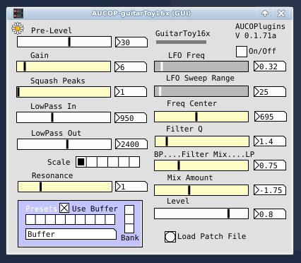

## AUCOP-guitarToy16x

Current Version: 0.1.72

AUCOP-guitarToy16x is a 16x-oversampled guitar audio processor. It includes a custom distortion module, an unusual filter module and a set of presets.

### Installation

Sorry, no install script yet...

#### All

- All: copy the .AUCOP directory to the home path "~/". This only holds preset files currently.

#### Linux Plugins

- LV2: copy the LV2 directory ("AUCOP-guitarToy16x.lv2") to the ~/.lv2 directory in your home dir. Or to the system LV2 directory.
- VST3: copy the vst3 directory ("AUCOP-guitarToy16x.vst3") to the ~/.vst3 directory in home dir. Or to the system VST3 directory.

#### Pure Data

- Copy the contents of the "pd" directory wherever is convenient.

#### Camomile

- Copy the contents of the "camomile" directory to the "Examples" folder in your Camomile install.

## Plugin use (copy of Info.txt)

AUCOP-guitarToy16x is a guitar-oriented effect plugin, with 16x oversampled distortion and a simple (and weird!) pre-filter.

### Use

AUCOP-guitarToy16x is a mono guitar effect. So one-in, one-out audio channels.

Click on the Preset buttons to reset the parameters (Unclick "Use Buffer" to access presets). These are loaded from a text file at start-up. Load different patches with the "Load Patch File" button.

Otherwise, it's a plugin; change the values, play your guitar.

## Parameters

### General Section

- Pre-Level: Input level, before any processing.
- Gain: Distortion gain.
- Squash Peaks: Asymmetrically down-scale the peaks after the first level of distortion is appled. This does lower amplitude, so compensate with Level.
- Low Pass In: Low-pass filter applied after up-sampling.
- Low Pass Out: Low-pass filter applied before down-sampling.
- Scale: Perform a destructive Pre and Post scaling of the signal, before the distortion and after.
- Resonance: Set the resonance of the low-pass filter, immediately after up-sampling.

### Preset section

- Use Buffer: Click for preset values "on load". These will either be the Camomile defaults, or the values saved and restored by the host (I.E., preset values saved in a DAW or FX chain in a plugin host).
- Preset: Click for preset in current Bank.
- Bank: Click to select Bank.

### Filter section

- LFO Freq: The filter has an optional LFO to alter the center frequency. On/Off enables/disables the LFO.
- LFO Sweep Range: The center frequency is shifted by this amount by the LFO.
- Freq Center: Filter center frequency.
- Filter Q: The Q value of the filter.
- Filter Mix: Alter the filter mix between Band-Pass and Low-Pass.
- Mix Amount: Mix the filtered signal with the incoming signal.
- Level: Overall volume output level.

### Patch specific

- Load Patch File: Loads a bank of patches.

**AUCOP**: An Unfortunate Collection Of Plugins

Plugin build from a *PureData* vanilla patch, with *Camomile*.

Version: 0.1.72
Author: Doug Garmon

--
#### Notes:
A post-distortion filter is appled before the signal is upsampled. It's currently set to a low frequency, to suppress higher harmonic alias issues.

This corresponds (very) loosely to the frequency response of guitar speakers.

#### AUCOP: An Unfortunate Collection Of Plugins

Plugin build from a PureData vanilla patch, with Camomile 1.0.7.

---

### Changes in 0.1.72

- Previous versions didn't correctly fetch/set the samplerate. The Pd version works fine, but Camomile needs additional code. AUCOP-guitarToy16x now works fine with higher sample rates (tested on 96000 and 192000 sps).
- After uploading with Camomile 1.0.7, I realized that version doesn't fix the xruns exhibited with openpanel obj in Debian Buster. So the guitarToy16x plugins are generated with the special "experimental" version of Camomile Pierre Guillot provided.

### Changes in 0.1.71

- New parameters have been added, and the parameters re-ordered.
- A custom parameter "get" subpatch replaces using param.get for each parameter. This reduces cpu overhead 10-15%.
- The preset file format has changed.
- The post-upsampling low-pass filter schema has changed -- it's now a biquad~ filter object, replacing the two-stage filter used previously. IMHO, this is quieter, and slightly reduces processor overhead.
- The presets have been rewritten due to the low-pass filter change.
- Preset files can be load (usually stored in ~/.AUCOP/).
- The plugin versions include a buffer filled at load time by the plugin host. Previous versions reset when the preset file was loaded. This was an important oversight in the first release.

### Thoughts About AUCOP-guitarToy16x

GuitarToy was conceived as a low-impact guitar "enhancer," a plugin that would offer a good basic guitar sound but not be overloaded with features. I always follow it with a reverb or delay effect. There are so many good and optimized reverbs, better to use an existing one.

It's evolved into something not-quite-so-low-impact, but that's due to moving from 8x to 16x oversampling. IMO the 16x version sounded so much better, the extra processing overhead is worth the cost.

A simple, custom distortion function uses the expr~ object, but mostly as a conditional statement and not for number crunching.

The filtering is done before upsampling to conserve cpu cycles. It's also an unusual filter setup; it's somewhat counter-intuitive, but sounds pretty nice. It also includes an LFO sweep function. I included this to add some subtle "motion" to the sound, but it can give more overt effects (LFO wha, or phase shifting "like" sounds). For some patches the LFO does introduce a little noise.

The presets are loaded from a text file inside the plugin (or Pd) folder. It's named "gtPresets_V2.txt" (previous versions "gtPresets.txt") and can be edited with any text editor. Here's the V2 parameter order & values for a preset patch:

#### Parameters Order, txt file:

1) Pre-Level: 1.0 - 50.0
2) Gain: 0.1 - 85.0
3) Level: 0.0 - 1.1
4) Resonance: 0.1 - 4.0 
5) Squash Peaks: 0.0 - 1.0
6) Scale: 0 - 5
7) LFO On/Off: 0 - 1
8) LFO Frequency: 0.0 - 5.0
9) LFO Sweep Range: 0.0 - 350.0
10) Frequency Center: 50.0 - 1500.0
11) Filter Q: 0.1 - 12.0
12) Filter Mix: 0.0 - 1.0
13) Mix Amount: 2.0 - -10.0
14) Lowpass In: 200.0 - 4400.0
15) Lowpass Out: 800.0 - 3800.0
16) Name: symbol string, no spaces

Patch parameters are separated by spaces, and each patch terminated with a semicolon. These specs are fairly typically when parsing text files within Pure Data.
