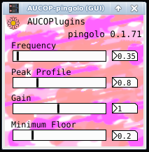

### AUCOP-pingolo

V 0.1.71

A simple ping-pong stereo pan/temolo effect plugin.

This one demonstrates the use of Camomile's "image" tag.

### Parameters

- Frequency: LFO frequency
- Peak Profile: Change the tremolo shape by clipping the LFO waveform (increase gain while clipping ceiling)
- Gain: Overall volume
- Floor: Set the signal floor, which lessens depth of effect (volume cannot drop below this level)

#### AUCOP: An Unfortunate Collection Of Plugins

Plugin build from a PureData vanilla patch, with Camomile.

Version: 0.1.71
Author: Doug Garmon
