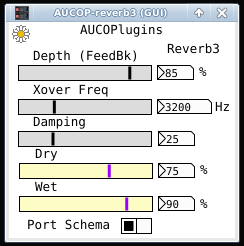

## AUCOP-reverb3

A Camomile plugin containing the Pure Data reverb3~ obj.

This plugin is included as a simple demo of Camomile, to illustrate these two points:

- How to make a interface with Graph-On-Parent in Camomile
- Use of an existing Pd abstraction within Camomile

Additionally, the more reverb plugins available in Linux/LV2, the better!

### Info.txt :

AUCOP-reverb3 is a reverb patch based on the Pd rev3~ object. 

### Parameters:

- Depth: Amount of Feedback
- Xover Freq: Crossover Freq in Hz
- Damping: High Freq damping
- Dry: Dry signal
- Wet: Wet signal
- Port Schema: Varies how the outputs of the reflections are mixed

### Notes:

The abstraction reverb3~.pd is included with all modern Pd distributions. This is basically unmodified for the plugin.

Why include a Pure Data version, when you can easily instantiate reverb3~ in your own patch? Just to be consistent, I suppose.
